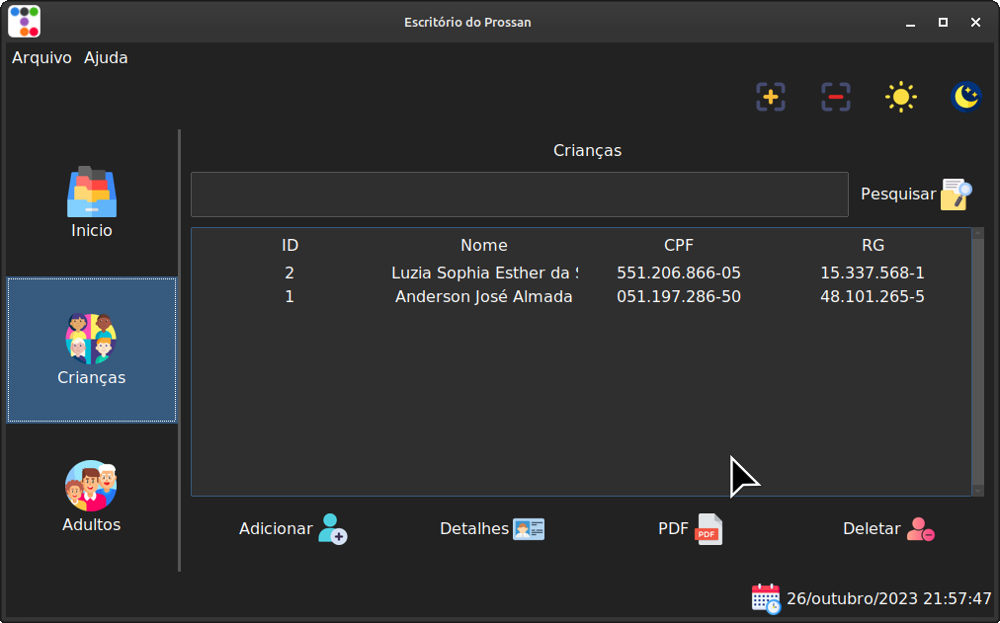

# Escritório do Prossan

Uma aplicação para gerenciar registros de alunos, voluntários e qualquer outra informação conveniente.




## Propósito

Atualmente, os registros são armazenados em documentos físicos, e a ideia deste projeto é facilitar o gerenciamento por meio de uma interface gráfica amigável.

## Tecnologias

- Interface Gráfica: Tkinter
- Banco de Dados: TinyDB

## Instalação

Siga as etapas abaixo para instalar:

1. Primeiramente, certifique-se de ter Python 3 instalado em seu sistema.

2. Instale as dependências do projeto executando o seguinte comando no terminal:

   ```bash
   python3 -m pip install -r requirements.txt
   ```

## Execução   
Execute o programa usando o seguinte comando:

   ```bash
   python3 main.py
   ```

## To-Do

- [x] CRUD Crianças.
- [x] CRUD Adultos.
- [ ] CRUD Voluntários.
- [ ] PDF Crianças.
- [ ] PDF Adultos.
- [ ] PDF Voluntáios.
- [ ] Pesquisar Crianças.
- [ ] Pesquisar Adultos.
- [ ] Pesquisar Voluntáios.

## Contribuições

Contribuições são bem-vindas! Se você quiser contribuir para o projeto, sinta-se à vontade para abrir 
uma issue ou enviar um pull request.
